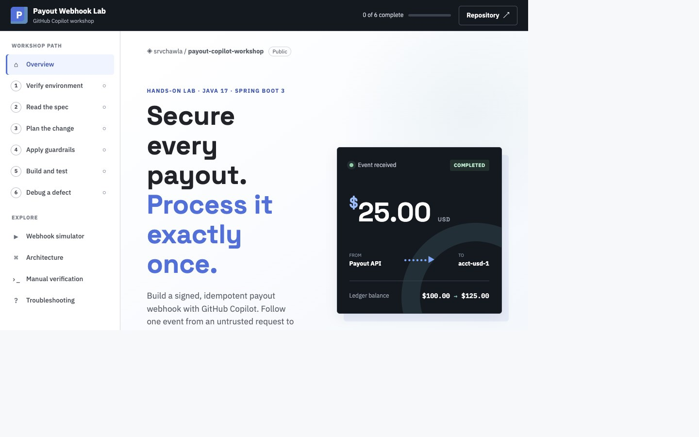

# Payout Copilot Workshop — Payout Webhook Service

[Open the interactive workshop](https://srvchawla.github.io/payout-copilot-workshop/#overview)

[](https://srvchawla.github.io/payout-copilot-workshop/#overview)

A hands-on GitHub Copilot workshop for backend engineers
(Java 17 / Spring Boot 3) built around a realistic scenario: ingesting payout
status webhooks securely and idempotently.

## Prerequisites

Complete these steps before the workshop:

- Java 17 or later installed and available on `PATH`.
- Rancher Desktop installed and running with the **`dockerd (moby)`** container
  engine selected.
- Docker and Docker Compose available: `docker version` and
  `docker compose version` should work.
- VS Code with the GitHub Copilot and GitHub Copilot Chat extensions installed.
- An active GitHub Copilot Business or Enterprise seat signed in through the
  GitHub organization used for the workshop.
- GitHub CLI installed and authenticated with `gh auth status`.
- Copilot CLI installed if participating in the CLI exercises.
- At least 4 GB of free memory for the local PostgreSQL and Redis containers.

Run the repository readiness check after cloning:

```bash
./scripts/verify-env.sh
```

## Learning Topics

- Secure and idempotent webhook ingestion
- Async processing, currency conversion, resilience, and retries
- Compliance rules and larger multi-file Agent Mode tasks
- GitHub workflow with Copilot Cloud Agent and Copilot Code Review

See [`docs/`](docs) for the facilitator guide, lab exercise guide, setup
checklist, [operations runbook](docs/runbook.md), and
[webhook diagrams](docs/webhook-diagrams.md).

## Lab Exercise Path

Mark an item complete by changing `[ ]` to `[x]` in this file. The `main`
branch is the lab exercise starting point; the `solution` branch is a
facilitator reference.

- [ ] **1. Verify the environment**

  **Open:** [`scripts/verify-env.sh`](scripts/verify-env.sh),
  [`docker-compose.yml`](docker-compose.yml), and
  [`src/main/resources/application.yml`](src/main/resources/application.yml).

  Run `./scripts/verify-env.sh`, then `./scripts/dev-up.sh`, which starts
  PostgreSQL, Redis, and the Spring Boot service. Open
  [http://localhost:8080/actuator/health](http://localhost:8080/actuator/health).

  **Done when:** the application, PostgreSQL, and Redis report `UP`.

- [ ] **2. Read the executable specification**

  **Open:** [`WebhookControllerTest.java`](src/test/java/com/payout/workshop/payout/webhook/WebhookControllerTest.java).

  Run `./mvnw test` and observe the intentional RED state. Read the four tests:
  invalid-signature rejection, successful crediting, FX conversion, and
  duplicate delivery. Do not edit the test file.

  **Done when:** you can explain what each test expects before writing code.

- [ ] **3. Plan the implementation with Plan Mode**

  **Open:** [`WebhookController.java`](src/main/java/com/payout/workshop/payout/webhook/WebhookController.java),
  [`SignatureVerifier.java`](src/main/java/com/payout/workshop/payout/webhook/SignatureVerifier.java),
  [`IdempotencyService.java`](src/main/java/com/payout/workshop/payout/webhook/IdempotencyService.java),
  [`PayoutEventListener.java`](src/main/java/com/payout/workshop/payout/webhook/PayoutEventListener.java),
  and [`LedgerService.java`](src/main/java/com/payout/workshop/payout/ledger/LedgerService.java).

  Use **Plan Mode** to propose the implementation sequence and identify risks
  before allowing code changes. Focus on the `TODO(workshop)` contracts.

  **Done when:** the plan explains the signature check, atomic Redis lock,
  asynchronous boundary, and ledger conversion flow.

- [ ] **4. Apply the repository guardrails**

  **Open:** [`.github/copilot-instructions.md`](.github/copilot-instructions.md)
  and [`.github/instructions/payout-webhook.instructions.md`](.github/instructions/payout-webhook.instructions.md).

  Review how repository-wide conventions and path-specific webhook security rules
  shape Copilot's suggestions. This is the **Custom Instructions** exercise.

  **Done when:** you know which rules apply automatically to the webhook files.

- [ ] **5. Implement and test with Agent Mode**

  Use **Agent Mode in the IDE** to implement the five TODO files without
  changing the tests. Ask it to run `./mvnw test` as it iterates.

  **Done when:** all tests pass and the implementation verifies signatures
  before parsing, uses one atomic Redis idempotency operation, handles events
  asynchronously, and uses `BigDecimal` for money.

- [ ] **6. Debug a seeded defect**

  Use **Agent Mode for debugging** with either
  [`SignatureVerifier.java`](src/main/java/com/payout/workshop/payout/webhook/SignatureVerifier.java)
  or [`IdempotencyService.java`](src/main/java/com/payout/workshop/payout/webhook/IdempotencyService.java).
  Introduce a timing-safe comparison defect or a check-then-set race, then ask
  Copilot to reproduce it, add a regression test, and repair the defect.

  **Done when:** the regression test fails against the defect and passes after
  the repair.

### Optional follow-up capabilities

Use these when they fit the session rather than treating them as required
steps: **Copilot CLI** for terminal investigation, **reusable prompts and
custom agents** for larger features, **Copilot Cloud Agent** for an issue-to-PR
task, and **Copilot Code Review** for the resulting pull request.

## Stack

- Java 17, Spring Boot 3.3, Maven wrapper (`./mvnw`)
- Postgres + Redis via `docker-compose.yml`, run through **Rancher Desktop**
  with the **`dockerd` (moby)** container engine
- Testcontainers-backed integration tests (the tests ARE the spec — see
  [`WebhookControllerTest`](src/test/java/com/payout/workshop/payout/webhook/WebhookControllerTest.java))

## Quick Start

```bash
./scripts/verify-env.sh   # confirms Java/Docker/Copilot CLI are ready
./scripts/dev-up.sh       # starts Postgres, Redis, and Spring Boot
```

Verify the complete stack before touching any code:
```bash
curl -s http://localhost:8080/actuator/health   # expect "status":"UP"
```
Or open http://localhost:8080/actuator/health directly in a browser.

You can rerun `./scripts/dev-up.sh` at any time. It leaves healthy services
running and recovers stopped containers or the managed Spring Boot process.
If application startup fails, inspect `.run/payout-service.log`.

Then run the test suite:
```bash
./mvnw test               # expect RED: webhook/ledger classes are TODO stubs
```

When finished, shut down all managed services gracefully:

```bash
./scripts/dev-down.sh     # stops Spring Boot, Postgres, and Redis
```

For day-to-day operations — health checks, manual webhook testing, Postgres
and Redis inspection, log locations, and troubleshooting — see
[`docs/runbook.md`](docs/runbook.md).

The lab is to make `./mvnw test` pass using Copilot Plan Mode, Custom
Instructions, and Agent Mode — see
[`docs/lab-guide.md`](docs/lab-guide.md).

## Repo Layout

```
src/main/java/com/payout/workshop/payout/
  webhook/   WebhookController, SignatureVerifier, IdempotencyService, PayoutEventListener  (TODO stubs — the lab)
  ledger/    AccountBalance, AccountRepository, LedgerService                                (LedgerService is a TODO stub)
  fx/        ConversionService                                                               (fully implemented stub, not the lesson)
.github/
  copilot-instructions.md                    repo-wide conventions
  instructions/payout-webhook.instructions.md path-scoped security/idempotency rules
docs/
  setup.md                    pre-work checklist sent to attendees
  facilitator-guide.md       run-of-show, timing, prompts, debug injection
  lab-guide.md               lab exercise step-by-step guide
  runbook.md                 operations runbook: startup, health, logs, shutdown
```
