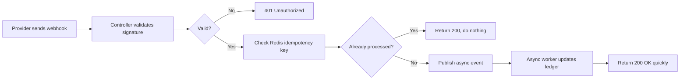
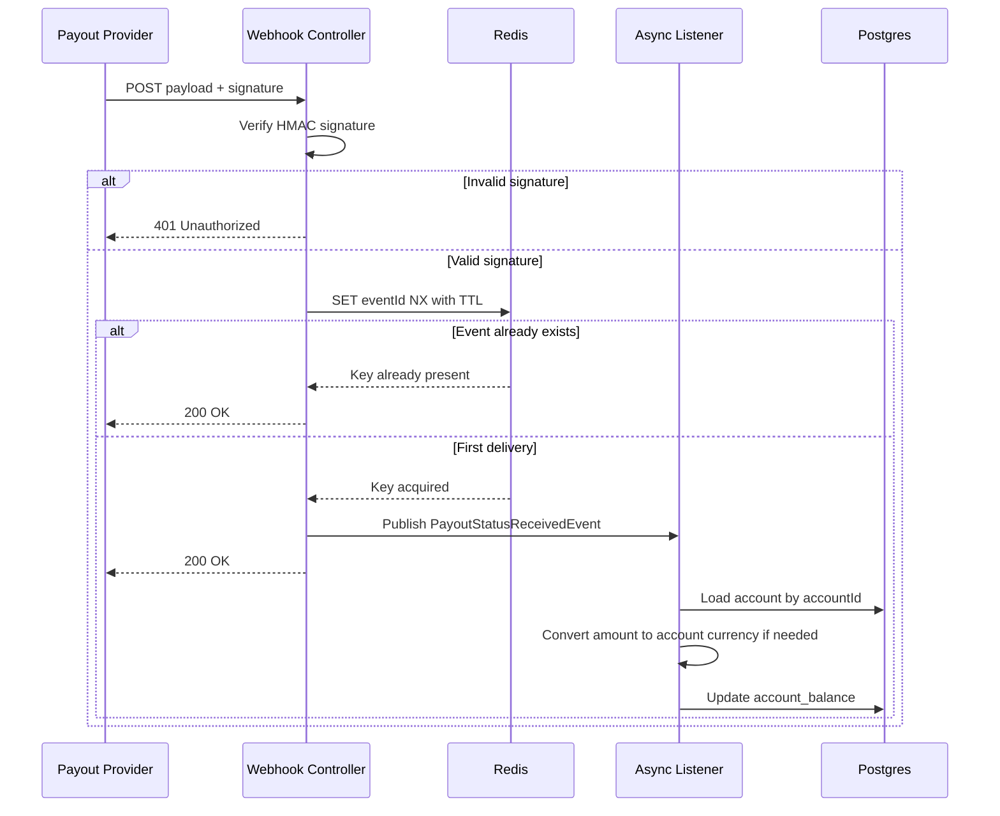
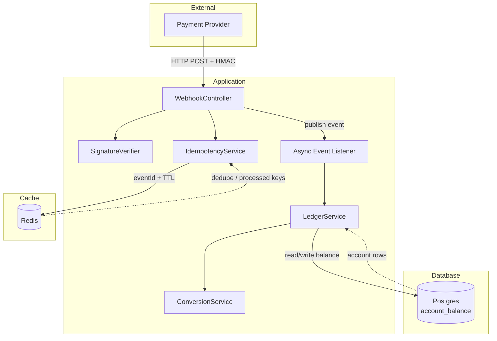

# Webhook Processing Diagrams

## 1) Simplified flow

## 2) Detailed webhook flow

## 3) Architecture view

## Why this flow matters

- Signature verification proves the request came from a trusted sender and was not tampered with.
- Redis deduplicates retries from at-least-once delivery by tracking a unique event ID with a TTL.
- The controller acknowledges the webhook quickly and does not block on slow ledger or FX work.
- The async listener performs the balance update safely and deterministically in the background.
